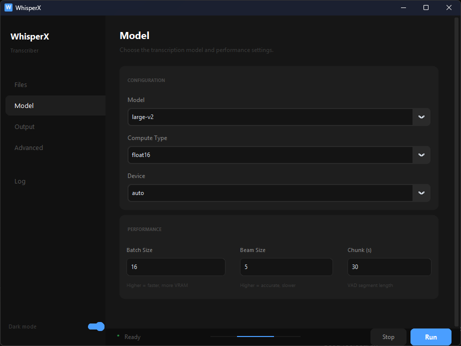

# Claude Code Instructions — WhisperX Transcriber Marketing Upgrade

## What you are doing

You are improving the GitHub presence and documentation of `whisperx-transcriber`
to make it more discoverable, trustworthy, and appealing to non-technical users.

**You are NOT changing any code.** No Python files, no requirements files,
no packaging scripts. Documentation and web files only.

Read `PLAN.md` for the full context and rationale before starting.

---

## Prerequisites

Make sure you are in the root of the `whisperx-transcriber` repository:
```bash
pwd  # should end in /whisperx-transcriber
ls   # should show app.py, README.md, etc.
```

---

## Step 1 — Rewrite README.md

Replace the existing README.md with a marketing-first version.
Keep all technical accuracy. Restructure the order so non-technical users
see value immediately.

### New README.md content:

```markdown
<div align="center">

# WhisperX Transcriber

**Offline AI transcription for Windows.**
Word-level timestamps. 99 languages. No cloud. No subscription. Free forever.

[](LICENSE)
[](https://github.com/ibrahimqureshae/whisperx-transcriber/releases)
[](#)
[](#)
[](#)

[**⬇️ Download for Windows**](https://github.com/ibrahimqureshae/whisperx-transcriber/releases/latest)
&nbsp;&nbsp;·&nbsp;&nbsp;
[Documentation](#for-developers)
&nbsp;&nbsp;·&nbsp;&nbsp;
[Report a bug](https://github.com/ibrahimqureshae/whisperx-transcriber/issues)
&nbsp;&nbsp;·&nbsp;&nbsp;
[❤️ Sponsor](https://github.com/sponsors/ibrahimqureshae)



</div>

---

## Why WhisperX Transcriber?

Most transcription tools are expensive cloud services that send your audio to someone else's server — or complex Python scripts that require a terminal and technical setup. WhisperX Transcriber is neither.

It's a clean Windows desktop app powered by OpenAI's Whisper model. Download once, transcribe forever — completely offline.

---

## Key Features

| | |
|---|---|
| 🔒 **100% private** | Your audio never leaves your machine. No cloud, no API key, no account. |
| ⚡ **Word-level timestamps** | Every word is precisely timed — not just sentence segments. Essential for subtitles and content search. |
| 🌐 **99 languages** | Arabic, Urdu, Persian, Chinese, Hindi, and 94 more. Right-to-left scripts supported natively. |
| 🖥️ **No terminal required** | Extract the zip, run the exe, click through a one-time wizard. Done. |
| 🎯 **Fast and accurate** | Powered by faster-whisper + WhisperX — the fastest open-source speech stack available. |
| 📦 **Multiple export formats** | SRT, VTT, TXT, TSV, JSON, Word JSON — pick what your workflow needs. |
| 🔁 **Works offline forever** | AI engine downloads once (~1–3 GB). Every transcription after that needs no internet. |

---

## Who uses this

🎙️ **Journalists** — transcribe interviews with accurate timestamps, no upload required

📹 **Content creators** — generate subtitles for YouTube, TikTok, and Reels in minutes

🔬 **Researchers & academics** — batch-process lectures, fieldwork recordings, and seminars

📝 **Translators** — get a timestamped base transcript before translating

🎓 **Students** — transcribe recorded classes and seminars offline

🔒 **Privacy-conscious users** — nothing is ever uploaded anywhere

---

## How it works

```
1. Download & extract     →   No installer. No admin rights needed.
2. Run setup wizard       →   One-time download of AI engine (~1–3 GB)
3. Transcribe anything    →   100% offline from here on. Forever.
```

**Setup time:** 5–30 minutes (depending on connection speed, one time only)
**Transcription speed:** Up to 15× faster than realtime on a modern NVIDIA GPU

---

## Getting started

### Step 1 — Download

Go to [**Releases**](https://github.com/ibrahimqureshae/whisperx-transcriber/releases) and download `WhisperXTranscriber.zip` (~19 MB).

### Step 2 — Extract and run

Extract the zip anywhere (e.g. `C:\Apps\WhisperXTranscriber\`) and double-click `WhisperXTranscriber.exe`. No installer, no admin rights required.

### Step 3 — First launch (one-time, internet required)

The **Setup Wizard** opens automatically:

1. **Welcome** — shows what will be downloaded and your GPU status
2. **Begin Setup** — downloads the AI engine (~1–3 GB, takes 5–30 min)
3. **Done** — click Launch. Every future launch opens instantly with no internet needed

> **Python 3.10+ is required** for the setup wizard. Install from [python.org](https://www.python.org/downloads/) and tick **"Add Python to PATH"**. After setup, Python runs internally — you never need to touch it again.

### Step 4 — Transcribe

1. Click **Files** → select your audio or video file
2. Go to **Model** → choose model size and device
3. Go to **Output** → choose your export formats
4. Click **Run**

---

## Performance

| | CPU | GPU (NVIDIA) |
|---|---|---|
| Setup download | ~1 GB | ~2–3 GB |
| Transcription speed | ~0.3–0.5× realtime | ~8–15× realtime |
| Hardware required | Any Windows PC | NVIDIA GPU + driver 525+ |

The app auto-detects your GPU. You can override in the **Model** panel.

---

## Models

Models download on first use and are cached locally — never re-downloaded.

| Model | Size | Best for |
|---|---|---|
| `tiny` | ~75 MB | Quick preview, low accuracy |
| `base` | ~145 MB | Fast drafts |
| `small` | ~465 MB | Good balance of speed and accuracy |
| `medium` | ~1.5 GB | High accuracy |
| `large-v2` *(default)* | ~3 GB | Best quality — recommended |
| `large-v3` | ~3 GB | Latest Whisper large model |

Start with `large-v2` unless you need faster results or have limited disk space.

---

## Output formats

| Format | Description |
|---|---|
| `srt` | Standard subtitles — works in VLC, YouTube, Premiere, DaVinci Resolve |
| `vtt` | WebVTT subtitles — for web video players |
| `txt` | Plain text transcript — no timestamps |
| `tsv` | Tab-separated with start/end timestamps per segment |
| `json` | Full segment-level JSON with all metadata |
| `word_json` | Per-word `{word, start, end, score}` — for developers and downstream tools |

Multiple formats can be selected at once. All saved to the same output folder.

---

## Supported languages

The GUI exposes **17 languages** with a dropdown. The underlying model supports **99 languages** via the CLI.

| Language | Code | Language | Code |
|---|---|---|---|
| English | `en` | Russian | `ru` |
| Arabic | `ar` | Portuguese | `pt` |
| French | `fr` | Italian | `it` |
| German | `de` | Dutch | `nl` |
| Spanish | `es` | Polish | `pl` |
| Chinese | `zh` | Turkish | `tr` |
| Japanese | `ja` | Persian | `fa` |
| Korean | `ko` | Urdu | `ur` |
| Hindi | `hi` | | |

**Auto-detect** mode lets Whisper identify the language automatically.

---

## Troubleshooting

**"Python not found"** — Install [Python 3.10+](https://www.python.org/downloads/) and tick "Add Python to PATH". Re-run the app.

**Setup fails mid-download** — Click **Retry**. The wizard resumes and skips already-installed packages.

**CUDA out of memory** — Lower Batch Size in the Model panel. Try 8, then 4.

**Alignment fails** — Disable word alignment in the Output panel. All other formats still export without it.

**Transcription is slow on CPU** — Use a smaller model (`small` or `base`), or reduce Batch Size.

**Anything else** — Open a [GitHub issue](https://github.com/ibrahimqureshae/whisperx-transcriber/issues) and paste the log output (click **Log** in the sidebar).

---

## Roadmap

- [ ] Drag-and-drop file input
- [ ] Batch folder transcription
- [ ] Speaker diarization UI
- [ ] In-app transcript editor
- [ ] Translation mode (transcribe + translate to English)
- [ ] macOS `.app` bundle
- [ ] Linux AppImage

---

## For Developers

> Clone, run one script, and you're in.

### Requirements

- Python 3.10, 3.11, 3.12, or 3.13
- Git
- Windows (Linux/macOS supported via `run.sh`, GUI features may vary)
- NVIDIA GPU recommended but not required

### Quick start

```bash
git clone https://github.com/ibrahimqureshae/whisperx-transcriber.git
cd whisperx-transcriber
run.bat          # Windows
bash run.sh      # macOS / Linux
```

`run.bat` / `run.sh` creates a `.venv`, detects your GPU, installs everything,
and launches the app. Every subsequent run opens instantly.

### Project structure

```
whisperx-transcriber/
├── app.py                  Main GUI application
├── launcher.py             Entry point for the packaged .exe
├── setup_wizard.py         First-run wizard
├── transcribe.py           Headless CLI for scripting and batch use
├── run.bat                 Windows developer launcher
├── run.sh                  macOS / Linux developer launcher
├── requirements-cpu.txt    PyTorch CPU wheels
├── requirements-gpu.txt    PyTorch CUDA wheels
├── requirements-core.txt   whisperx, customtkinter, Pillow
├── requirements-build.txt  Build tools (pyinstaller)
├── packaging/
│   ├── build.bat           Builds portable zip
│   └── launcher.spec       PyInstaller spec
└── assets/
    └── icon.ico            App icon
```

### CLI usage

```bash
python transcribe.py audio.mp3
python transcribe.py audio.mp3 --language ar --model large-v2
python transcribe.py audio.mp3 --device cpu --output srt
python transcribe.py audio.mp3 --model-dir D:\models
```

### Tech stack

| Layer | Library |
|---|---|
| GUI | [customtkinter](https://github.com/TomSchimansky/CustomTkinter) |
| Transcription | [WhisperX](https://github.com/m-bain/whisperX) |
| ASR backend | [faster-whisper](https://github.com/SYSTRAN/faster-whisper) |
| Inference runtime | [CTranslate2](https://github.com/OpenNMT/CTranslate2) |
| Packaging | [PyInstaller](https://pyinstaller.org/) |

See [CONTRIBUTING.md](CONTRIBUTING.md) to get started contributing.

---

## Contributing

Contributions are welcome. Bug reports, feature requests, code, language additions,
and testing on different hardware all help.

See [CONTRIBUTING.md](CONTRIBUTING.md) for full details.

---

## Support the project

WhisperX Transcriber is free and will stay free. If it saves you time or money,
consider sponsoring development:

[❤️ Sponsor on GitHub](https://github.com/sponsors/ibrahimqureshae)

Sponsorships fund continued development, new features, and platform support (macOS, Linux).

---

## License

MIT — free to use, modify, and distribute. See [LICENSE](LICENSE).

---

<div align="center">
Built on open-source foundations: <a href="https://github.com/openai/whisper">OpenAI Whisper</a> · <a href="https://github.com/m-bain/whisperX">WhisperX</a> · <a href="https://github.com/SYSTRAN/faster-whisper">faster-whisper</a> · <a href="https://github.com/TomSchimansky/CustomTkinter">customtkinter</a>
</div>
```

---

## Step 2 — Create .github/FUNDING.yml

```bash
mkdir -p .github
```

Create `.github/FUNDING.yml`:

```yaml
github: ibrahimqureshae
```

---

## Step 3 — Create docs/index.html (GitHub Pages landing page)

```bash
mkdir -p docs
```

Create `docs/index.html` with the full landing page. Use clean HTML/CSS only —
no frameworks. Must support dark mode via `prefers-color-scheme`.

### Full file content:

```html
<!DOCTYPE html>
<html lang="en">
<head>
  <meta charset="UTF-8">
  <meta name="viewport" content="width=device-width, initial-scale=1.0">
  <title>WhisperX Transcriber — Offline AI Transcription for Windows</title>
  <meta name="description" content="Free offline AI transcription for Windows. Word-level timestamps, 99 languages, no cloud, no subscription. Powered by OpenAI Whisper.">
  <meta property="og:title" content="WhisperX Transcriber">
  <meta property="og:description" content="Offline AI transcription. No cloud. No subscription. Free forever.">
  <meta property="og:image" content="https://raw.githubusercontent.com/ibrahimqureshae/whisperx-transcriber/main/assets/screenshot.png">
  <meta name="twitter:card" content="summary_large_image">
  <style>
    *, *::before, *::after { box-sizing: border-box; margin: 0; padding: 0; }

    :root {
      --bg: #ffffff;
      --bg2: #f7f7f5;
      --text: #1a1a18;
      --text2: #5a5a56;
      --border: rgba(0,0,0,0.1);
      --accent: #1a6ef5;
      --accent-bg: #e8f0fe;
      --green: #0a7c4e;
      --green-bg: #e6f4ee;
      --radius: 10px;
    }

    @media (prefers-color-scheme: dark) {
      :root {
        --bg: #141413;
        --bg2: #1e1e1c;
        --text: #e8e8e4;
        --text2: #9a9a94;
        --border: rgba(255,255,255,0.1);
        --accent: #4d8ef7;
        --accent-bg: #1a2540;
        --green: #2ec07a;
        --green-bg: #0d2b1e;
      }
    }

    body {
      font-family: -apple-system, BlinkMacSystemFont, "Segoe UI", sans-serif;
      background: var(--bg);
      color: var(--text);
      line-height: 1.6;
      font-size: 16px;
    }

    a { color: var(--accent); text-decoration: none; }
    a:hover { text-decoration: underline; }

    .container { max-width: 860px; margin: 0 auto; padding: 0 24px; }

    /* NAV */
    nav {
      border-bottom: 1px solid var(--border);
      padding: 16px 0;
      position: sticky; top: 0;
      background: var(--bg);
      z-index: 10;
    }
    nav .inner { max-width: 860px; margin: 0 auto; padding: 0 24px; display: flex; align-items: center; justify-content: space-between; }
    .nav-logo { font-weight: 600; font-size: 15px; color: var(--text); }
    .nav-links { display: flex; gap: 20px; font-size: 14px; color: var(--text2); }
    .nav-links a { color: var(--text2); }

    /* HERO */
    .hero { text-align: center; padding: 72px 0 56px; }
    .hero h1 { font-size: clamp(32px, 6vw, 52px); font-weight: 700; letter-spacing: -0.03em; line-height: 1.1; margin-bottom: 16px; }
    .hero .sub { font-size: 18px; color: var(--text2); max-width: 560px; margin: 0 auto 28px; line-height: 1.5; }
    .pill-row { display: flex; flex-wrap: wrap; gap: 8px; justify-content: center; margin-bottom: 32px; }
    .pill { font-size: 13px; padding: 4px 12px; border-radius: 20px; border: 1px solid var(--border); color: var(--text2); background: var(--bg2); }
    .pill.green { background: var(--green-bg); color: var(--green); border-color: transparent; }
    .btn-dl { display: inline-flex; align-items: center; gap: 8px; background: var(--accent); color: #fff; padding: 14px 28px; border-radius: var(--radius); font-size: 16px; font-weight: 600; text-decoration: none; }
    .btn-dl:hover { opacity: 0.9; text-decoration: none; }
    .btn-gh { display: inline-flex; align-items: center; gap: 8px; background: var(--bg2); color: var(--text); padding: 14px 22px; border-radius: var(--radius); font-size: 15px; font-weight: 500; text-decoration: none; border: 1px solid var(--border); margin-left: 12px; }
    .btn-gh:hover { background: var(--border); text-decoration: none; }

    /* SCREENSHOT */
    .screenshot { padding: 0 0 64px; text-align: center; }
    .screenshot img { max-width: 100%; border-radius: 12px; border: 1px solid var(--border); box-shadow: 0 8px 40px rgba(0,0,0,0.12); }

    /* FEATURES */
    .features { padding: 64px 0; border-top: 1px solid var(--border); }
    .section-title { font-size: 28px; font-weight: 700; letter-spacing: -0.02em; margin-bottom: 8px; }
    .section-sub { font-size: 16px; color: var(--text2); margin-bottom: 40px; }
    .feat-grid { display: grid; grid-template-columns: repeat(auto-fit, minmax(240px, 1fr)); gap: 16px; }
    .feat { background: var(--bg2); border: 1px solid var(--border); border-radius: var(--radius); padding: 20px; }
    .feat-icon { font-size: 24px; margin-bottom: 10px; }
    .feat h3 { font-size: 15px; font-weight: 600; margin-bottom: 6px; }
    .feat p { font-size: 14px; color: var(--text2); line-height: 1.5; }

    /* STEPS */
    .steps { padding: 64px 0; border-top: 1px solid var(--border); }
    .step-grid { display: grid; grid-template-columns: repeat(auto-fit, minmax(220px, 1fr)); gap: 24px; margin-top: 40px; }
    .step { text-align: center; }
    .step-num { width: 40px; height: 40px; border-radius: 50%; background: var(--accent-bg); color: var(--accent); font-weight: 700; font-size: 18px; display: flex; align-items: center; justify-content: center; margin: 0 auto 14px; }
    .step h3 { font-size: 15px; font-weight: 600; margin-bottom: 6px; }
    .step p { font-size: 14px; color: var(--text2); line-height: 1.5; }

    /* AUDIENCES */
    .audiences { padding: 64px 0; border-top: 1px solid var(--border); }
    .aud-grid { display: grid; grid-template-columns: repeat(auto-fit, minmax(160px, 1fr)); gap: 12px; margin-top: 32px; }
    .aud { background: var(--bg2); border: 1px solid var(--border); border-radius: var(--radius); padding: 16px; text-align: center; }
    .aud-emoji { font-size: 28px; margin-bottom: 8px; }
    .aud h3 { font-size: 14px; font-weight: 600; margin-bottom: 4px; }
    .aud p { font-size: 12px; color: var(--text2); }

    /* FORMATS */
    .formats { padding: 64px 0; border-top: 1px solid var(--border); }
    .format-row { display: flex; flex-wrap: wrap; gap: 10px; margin-top: 24px; }
    .format-pill { background: var(--bg2); border: 1px solid var(--border); border-radius: 8px; padding: 10px 18px; font-family: monospace; font-size: 14px; font-weight: 600; color: var(--text); }

    /* SPONSOR */
    .sponsor { padding: 64px 0; border-top: 1px solid var(--border); text-align: center; }
    .sponsor p { color: var(--text2); max-width: 480px; margin: 12px auto 28px; font-size: 15px; }
    .btn-sponsor { display: inline-flex; align-items: center; gap: 8px; background: var(--bg2); color: var(--text); padding: 12px 24px; border-radius: var(--radius); font-size: 15px; font-weight: 500; border: 1px solid var(--border); text-decoration: none; }
    .btn-sponsor:hover { background: var(--border); text-decoration: none; }

    /* FOOTER */
    footer { border-top: 1px solid var(--border); padding: 32px 0; text-align: center; font-size: 14px; color: var(--text2); }
    footer a { color: var(--text2); margin: 0 10px; }

    @media (max-width: 600px) {
      .btn-gh { display: none; }
      .nav-links { display: none; }
    }
  </style>
</head>
<body>

<nav>
  <div class="inner">
    <span class="nav-logo">WhisperX Transcriber</span>
    <div class="nav-links">
      <a href="#features">Features</a>
      <a href="#how-it-works">How it works</a>
      <a href="https://github.com/ibrahimqureshae/whisperx-transcriber">GitHub</a>
    </div>
  </div>
</nav>

<div class="container">

  <section class="hero">
    <h1>Offline AI transcription.<br>Free forever.</h1>
    <p class="sub">Word-level timestamps. 99 languages. Your audio never leaves your machine. No cloud. No subscription.</p>
    <div class="pill-row">
      <span class="pill green">✓ 100% offline</span>
      <span class="pill green">✓ No subscription</span>
      <span class="pill green">✓ Open source · MIT</span>
      <span class="pill">Windows · macOS coming soon</span>
    </div>
    <a href="https://github.com/ibrahimqureshae/whisperx-transcriber/releases/latest" class="btn-dl">
      ⬇️ Download for Windows
    </a>
    <a href="https://github.com/ibrahimqureshae/whisperx-transcriber" class="btn-gh">
      ★ GitHub
    </a>
  </section>

  <section class="screenshot">
    
  </section>

  <section class="features" id="features">
    <h2 class="section-title">Everything you need. Nothing you don't.</h2>
    <p class="section-sub">Powered by OpenAI's Whisper model and the fastest open-source inference stack available.</p>
    <div class="feat-grid">
      <div class="feat">
        <div class="feat-icon">🔒</div>
        <h3>100% private</h3>
        <p>Your audio never leaves your machine. No uploads, no API key, no account required.</p>
      </div>
      <div class="feat">
        <div class="feat-icon">⚡</div>
        <h3>Word-level timestamps</h3>
        <p>Every word precisely timed — not just sentence segments. Essential for subtitles and content editing.</p>
      </div>
      <div class="feat">
        <div class="feat-icon">🌐</div>
        <h3>99 languages</h3>
        <p>Arabic, Urdu, Persian, Chinese, Hindi, and 94 more. Right-to-left scripts supported natively.</p>
      </div>
      <div class="feat">
        <div class="feat-icon">🖥️</div>
        <h3>No terminal needed</h3>
        <p>Extract the zip, double-click the exe, click through the setup wizard. That's it.</p>
      </div>
      <div class="feat">
        <div class="feat-icon">🚀</div>
        <h3>Up to 15× realtime</h3>
        <p>On a modern NVIDIA GPU, WhisperX transcribes faster than realtime. CPU mode also available.</p>
      </div>
      <div class="feat">
        <div class="feat-icon">📦</div>
        <h3>Multiple export formats</h3>
        <p>SRT, VTT, TXT, TSV, JSON, and Word JSON. Export to whatever your workflow requires.</p>
      </div>
    </div>
  </section>

  <section class="steps" id="how-it-works">
    <h2 class="section-title">How it works</h2>
    <p class="section-sub">Three steps. One-time setup. Offline forever.</p>
    <div class="step-grid">
      <div class="step">
        <div class="step-num">1</div>
        <h3>Download &amp; extract</h3>
        <p>Download the ~19 MB zip from GitHub Releases. Extract anywhere. No installer, no admin rights.</p>
      </div>
      <div class="step">
        <div class="step-num">2</div>
        <h3>Run setup wizard</h3>
        <p>One-time download of the AI engine (~1–3 GB). The wizard handles everything automatically.</p>
      </div>
      <div class="step">
        <div class="step-num">3</div>
        <h3>Transcribe forever</h3>
        <p>Fully offline from here on. Select a file, choose your model and output format, click Run.</p>
      </div>
    </div>
  </section>

  <section class="audiences">
    <h2 class="section-title">Built for people who work with audio</h2>
    <p class="section-sub">Any workflow, any language, any file.</p>
    <div class="aud-grid">
      <div class="aud"><div class="aud-emoji">🎙️</div><h3>Journalists</h3><p>Transcribe interviews with accurate timestamps</p></div>
      <div class="aud"><div class="aud-emoji">📹</div><h3>Content creators</h3><p>Generate subtitles for videos in minutes</p></div>
      <div class="aud"><div class="aud-emoji">🔬</div><h3>Researchers</h3><p>Batch-process lectures and fieldwork recordings</p></div>
      <div class="aud"><div class="aud-emoji">📝</div><h3>Translators</h3><p>Get a timestamped base before translating</p></div>
      <div class="aud"><div class="aud-emoji">🎓</div><h3>Students</h3><p>Transcribe recorded classes and seminars</p></div>
      <div class="aud"><div class="aud-emoji">🔒</div><h3>Privacy-first</h3><p>Nothing ever uploaded anywhere</p></div>
    </div>
  </section>

  <section class="formats">
    <h2 class="section-title">Export formats</h2>
    <p class="section-sub">Select multiple formats at once. All saved to the same output folder.</p>
    <div class="format-row">
      <div class="format-pill">SRT</div>
      <div class="format-pill">VTT</div>
      <div class="format-pill">TXT</div>
      <div class="format-pill">TSV</div>
      <div class="format-pill">JSON</div>
      <div class="format-pill">word_json</div>
    </div>
  </section>

  <section class="sponsor">
    <h2 class="section-title">❤️ Support the project</h2>
    <p>WhisperX Transcriber is free and will stay free. If it saves you time, consider sponsoring to fund new features — speaker diarization, macOS support, and more.</p>
    <a href="https://github.com/sponsors/ibrahimqureshae" class="btn-sponsor">
      ❤️ Sponsor on GitHub
    </a>
  </section>

</div>

<footer>
  <div>
    <a href="https://github.com/ibrahimqureshae/whisperx-transcriber">GitHub</a>
    <a href="https://github.com/ibrahimqureshae/whisperx-transcriber/releases">Releases</a>
    <a href="https://github.com/ibrahimqureshae/whisperx-transcriber/issues">Issues</a>
    <a href="https://github.com/sponsors/ibrahimqureshae">Sponsor</a>
  </div>
  <div style="margin-top: 12px;">MIT License · Built on OpenAI Whisper, WhisperX, faster-whisper</div>
</footer>

</body>
</html>
```

---

## Step 4 — Create CHANGELOG.md

Create `CHANGELOG.md` in the repo root:

```markdown
# Changelog

All notable changes to WhisperX Transcriber are documented here.

## [v1.0.0] — 2026-06-07

### Added
- Full GUI desktop app for Windows (customtkinter)
- One-time Setup Wizard with automatic GPU/CPU detection
- Support for 17 languages in the GUI dropdown, 99 via CLI
- Word-level timestamp alignment via WhisperX
- Export to SRT, VTT, TXT, TSV, JSON, and Word JSON formats
- CPU and GPU (CUDA) transcription support
- Fully offline operation after one-time setup
- VAD (Voice Activity Detection) silence stripping
- Karaoke-style word-highlighted subtitle export
- Model support: tiny, base, small, medium, large-v2, large-v3
- Headless CLI (transcribe.py) for scripting and batch use
- Portable distribution — no installer, no admin rights required
- Thin launcher pattern — ~19 MB exe, AI engine installed separately
- Auto-detection of NVIDIA GPU with CPU fallback
```

---

## Step 5 — Create CONTRIBUTING.md

Create `CONTRIBUTING.md` in the repo root:

```markdown
# Contributing to WhisperX Transcriber

Contributions are genuinely welcome — whether you're fixing a bug,
improving the UI, adding a language, or just reporting an issue.

## Ways to contribute

- **Bug reports** — open an [issue](https://github.com/ibrahimqureshae/whisperx-transcriber/issues) with log output and steps to reproduce
- **Feature requests** — open an issue describing the use case and why it matters
- **Code contributions** — fork the repo, make your changes, open a pull request
- **Language support** — add entries to the `_lang_map` dict in `app.py` (one line per language)
- **Testing** — test on different hardware, Windows versions, or audio types and share findings
- **Documentation** — fix typos, improve clarity, add examples

## Getting started

```bash
git clone https://github.com/ibrahimqureshae/whisperx-transcriber.git
cd whisperx-transcriber
run.bat   # creates .venv, installs everything, launches the app
```

## Project structure

The codebase is intentionally small and readable:

- `app.py` — the entire GUI (~1000 lines)
- `setup_wizard.py` — the first-run installer
- `transcribe.py` — the headless CLI

No framework magic, no hidden abstractions. A new contributor can understand
the whole project in an afternoon.

## Pull request guidelines

- Keep PRs focused — one feature or fix per PR
- Test on both CPU and GPU if possible
- Don't change requirements files without a clear reason
- Update CHANGELOG.md with a brief description of your change

## Reporting bugs

Please include:
1. Steps to reproduce
2. Expected vs actual behaviour
3. Log output (click **Log** in the sidebar and paste it)
4. Your system: Windows version, GPU model (if any), model used, file format
```

---

## Step 6 — Create SECURITY.md

Create `SECURITY.md` in the repo root:

```markdown
# Security

## Reporting a vulnerability

If you discover a security issue, please open a
[GitHub issue](https://github.com/ibrahimqureshae/whisperx-transcriber/issues)
or contact the maintainer directly via GitHub.

## How this app handles your data

WhisperX Transcriber is designed to be **completely private by default**:

- **No network requests during normal operation.** The app makes zero outbound
  connections after the one-time setup is complete.
- **No telemetry.** No usage data, crash reports, or analytics are ever collected or sent.
- **No hidden processes.** The full source code is public and auditable — you can
  verify exactly what the app does.
- **Local models only.** AI models are downloaded once to your local disk and
  run entirely on your own hardware.

The only time the app accesses the internet is during the **first-run Setup Wizard**,
which downloads the AI engine (PyTorch, WhisperX) from their official sources (PyPI, HuggingFace).
After setup is complete, the app never needs the internet again.
```

---

## Step 7 — Create issue templates

```bash
mkdir -p .github/ISSUE_TEMPLATE
```

Create `.github/ISSUE_TEMPLATE/bug_report.md`:

```markdown
---
name: Bug report
about: Something isn't working
title: '[Bug] '
labels: bug
---

**Describe the bug**
A clear description of what went wrong.

**Steps to reproduce**
1.
2.
3.

**Expected behaviour**
What you expected to happen.

**Log output**
Click **Log** in the sidebar and paste the full output here.

**System info**
- Windows version:
- GPU (if any):
- Model used:
- File format / size:
- CPU or GPU mode:
```

Create `.github/ISSUE_TEMPLATE/feature_request.md`:

```markdown
---
name: Feature request
about: Suggest a new feature or improvement
title: '[Feature] '
labels: enhancement
---

**What problem does this solve?**
Describe the situation or pain point this would address.

**Describe the feature**
What should it do? How should it work?

**Who would benefit?**
Journalists, content creators, researchers, etc.

**Any alternatives you've considered?**
```

---

## Step 8 — Verify everything

Run these checks after completing all steps:

```bash
# Confirm all new files exist
ls .github/FUNDING.yml
ls .github/ISSUE_TEMPLATE/bug_report.md
ls .github/ISSUE_TEMPLATE/feature_request.md
ls docs/index.html
ls CHANGELOG.md
ls CONTRIBUTING.md
ls SECURITY.md
ls README.md

# Confirm no Python source files were modified
git diff --name-only | grep "\.py$"
# This should return nothing. If it returns any .py files, do NOT commit those.

# Review the git diff summary
git diff --stat
```

---

## Step 9 — Commit

```bash
git add README.md CHANGELOG.md CONTRIBUTING.md SECURITY.md
git add .github/FUNDING.yml
git add .github/ISSUE_TEMPLATE/
git add docs/index.html

git commit -m "docs: marketing-first README, landing page, community files

- Rewrite README as product landing page (user-first structure)
- Add badges, cleaner hero, feature highlights
- Add docs/index.html GitHub Pages landing page
- Add .github/FUNDING.yml for Sponsors button
- Add CHANGELOG.md, CONTRIBUTING.md, SECURITY.md
- Add GitHub issue templates (bug report, feature request)"

git push origin main
```

---

## After pushing — manual steps (do in GitHub UI)

1. **Enable GitHub Pages:**
   Settings → Pages → Source: `Deploy from a branch` → Branch: `main`, Folder: `/docs` → Save

2. **Update repo description:**
   Repo homepage → gear icon → Description:
   `Offline AI transcription for Windows. Word-level timestamps. No cloud. No subscription. Free forever.`

3. **Add repo topics:**
   Repo homepage → gear icon → Topics:
   `whisper whisperx speech-to-text transcription subtitles offline-ai privacy windows-app audio-transcription faster-whisper word-timestamps srt vtt`

4. **Set up GitHub Sponsors:**
   github.com/sponsors (requires one-time enrollment) — the FUNDING.yml is already in place once enrolled

5. **Set social preview:**
   Settings → Social preview → upload a 1280×640px image

---

## What NOT to touch

- `app.py`
- `transcribe.py`
- `setup_wizard.py`
- `launcher.py`
- `requirements-*.txt`
- `run.bat` / `run.sh`
- `packaging/`
- `LICENSE`
- `version.txt`
- `.gitignore`
