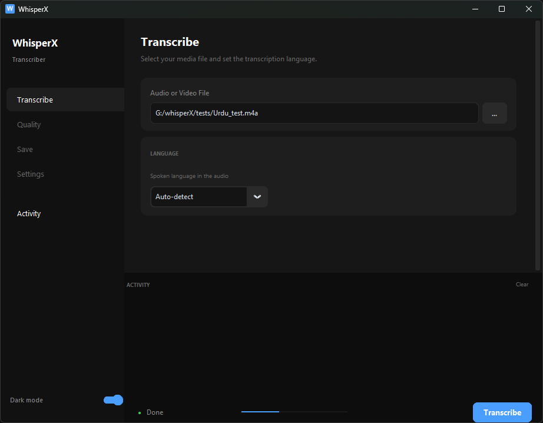
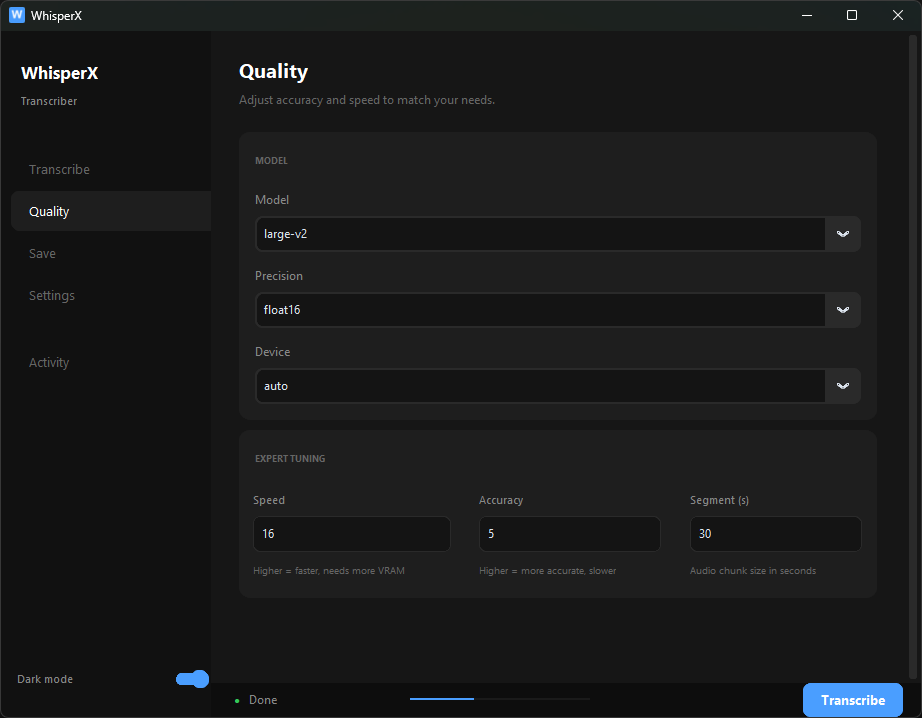
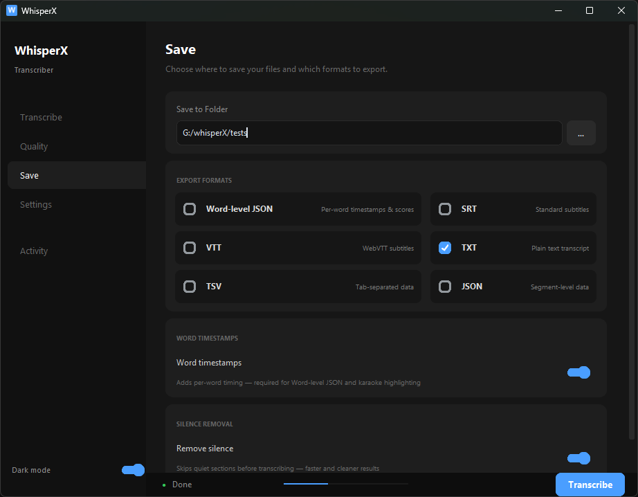
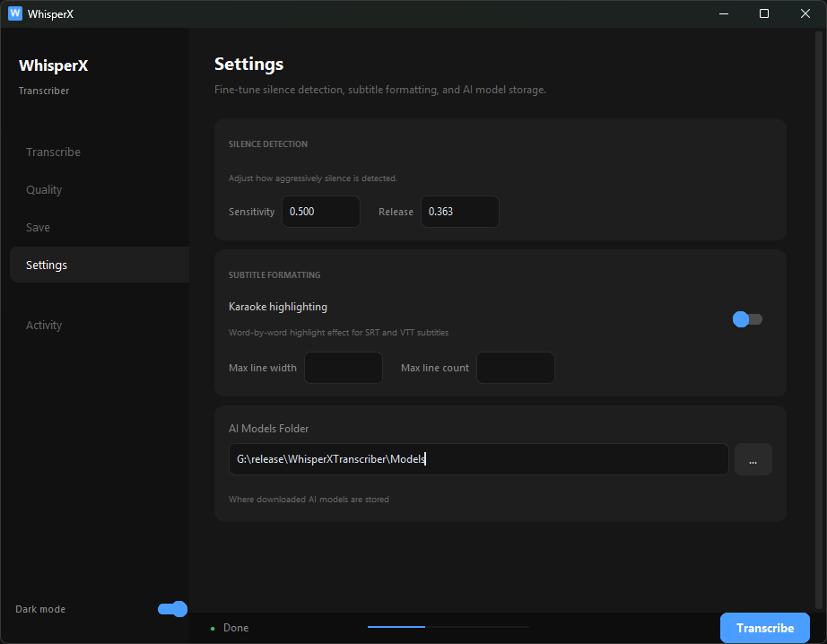
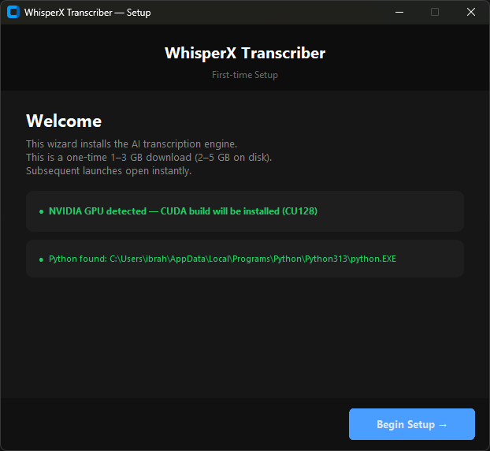
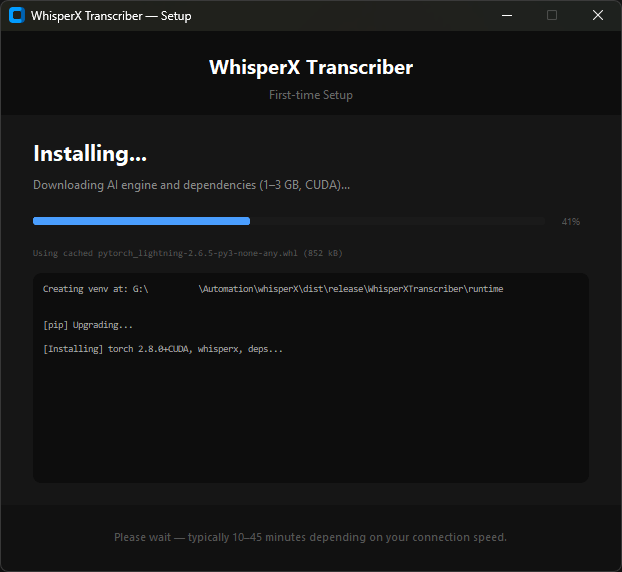

# WhisperX Transcriber

> A clean Windows desktop app for AI-powered audio and video transcription.  
> Word-level timestamps. Works completely offline. No subscription. No cloud. Free forever.

Built on [WhisperX](https://github.com/m-bain/whisperX) and [faster-whisper](https://github.com/SYSTRAN/faster-whisper) — some of the fastest, most accurate open-source speech recognition tools available.

[](https://github.com/sponsors/ibrahimqureshae)
[](https://www.paypal.me/mibrahimqr)
[](https://github.com/ibrahimqureshae/whisperx-transcriber/stargazers)
[](LICENSE)

<p align="center">
  
</p>

---

## Quick Access

**Is this for me?**
[Why use this?](#why-use-this) · [What you can do with it](#what-you-can-do-with-it) · [Supported languages](#supported-languages) · [Who is this for?](#who-is-this-for) · [See it in action](#see-it-in-action)

**Get Started**
[Download & install](#get-started) · [First-time setup](#3-complete-the-one-time-setup) · [CPU vs GPU](#cpu-vs-gpu) · [How to transcribe](#4-start-transcribing)

**Using the App**
[What the app looks like](#what-the-app-looks-like) · [Choosing a model](#choosing-a-model) · [Output formats](#output-formats) · [Troubleshooting](#troubleshooting)

**Build & Hack**
[Quick start](#quick-start) · [Project structure](#project-structure) · [How it works](#how-it-works-under-the-hood) · [CLI usage](#command-line-usage) · [Package a release](#package-a-release)

**Community & Support**
[What's coming](#whats-coming) · [Support the project](#support-the-project) · [Help build it](#help-build-it) · [What it's built on](#what-its-built-on) · [License](#license)

---

## Why use this?

Most transcription tools are either expensive cloud services that upload your audio to a remote server, or complex Python scripts that require technical setup. WhisperX Transcriber is neither.

- **Your audio never leaves your machine.** Everything runs locally — no cloud, no API key, no subscription.
- **One-time setup, then works forever offline.** The AI engine downloads once (~1–3 GB). After that, no internet needed — ever.
- **No terminal, no Python knowledge required.** Extract the zip, run the exe, click through a one-time setup wizard. Done.
- **Fast.** On a modern NVIDIA GPU, it transcribes faster than realtime. On CPU it's still practical for short and medium recordings.
- **Accurate.** Powered by OpenAI's Whisper large-v2 — one of the best open-source speech recognition models available.
- **Word-level timestamps.** Every word is timed precisely, not just sentence segments — essential for subtitles, content search, and editing.
- **Fully open source.** No telemetry, no tracking, no surprises. Every line of code is readable in this repo.

---

## What the app looks like

Four clean panels — everything is a click away, nothing is buried.

<table>
  <tr>
    <td align="center">
      <br/>
      <sub><b>Transcribe</b> — pick your file and language</sub>
    </td>
    <td align="center">
      <br/>
      <sub><b>Quality</b> — model, precision, device, expert tuning</sub>
    </td>
  </tr>
  <tr>
    <td align="center">
      <br/>
      <sub><b>Save</b> — export formats, word timestamps, silence removal</sub>
    </td>
    <td align="center">
      <br/>
      <sub><b>Settings</b> — silence detection, subtitle formatting, model folder</sub>
    </td>
  </tr>
</table>

---

## What you can do with it

- Transcribes **audio and video files** to text with word-level timestamps
- Exports to **SRT, VTT, TXT, TSV, JSON**, or a custom **Word JSON** format
- Supports **20 languages** in the GUI, **99 languages** via the CLI
- Auto-detects your **NVIDIA GPU** and uses CUDA — falls back to CPU automatically
- Strips silence with a built-in **Voice Activity Detection (VAD)** filter
- Produces **karaoke-style subtitles** with word-by-word highlighting in SRT/VTT
- Runs **100% offline** after the one-time first-run setup

---

## See it in action

### English — "The quick brown fox…"

🔊 [**Download sample audio**](assets/samples/English_test.wav) *(WAV, ~10 seconds)*

Transcribed with `large-v2`, word timestamps enabled:

**Plain text**
```
The quick brown fox jumps over the lazy dog.
```

**SRT — word-level, every word precisely timed**
```srt
1
00:00:00,000 --> 00:00:00,480
The

2
00:00:00,480 --> 00:00:00,820
quick

3
00:00:00,820 --> 00:00:01,120
brown

4
00:00:01,120 --> 00:00:01,380
fox

5
00:00:01,380 --> 00:00:01,800
jumps

6
00:00:01,800 --> 00:00:02,040
over

7
00:00:02,040 --> 00:00:02,240
the

8
00:00:02,240 --> 00:00:02,560
lazy

9
00:00:02,560 --> 00:00:03,080
dog.
```

**Word JSON — per-word confidence scores**
```json
[
  { "word": "The",   "start": 0.00, "end": 0.48, "score": 0.99 },
  { "word": "quick", "start": 0.48, "end": 0.82, "score": 0.99 },
  { "word": "brown", "start": 0.82, "end": 1.12, "score": 0.98 },
  { "word": "fox",   "start": 1.12, "end": 1.38, "score": 0.99 },
  { "word": "jumps", "start": 1.38, "end": 1.80, "score": 0.99 },
  { "word": "over",  "start": 1.80, "end": 2.04, "score": 0.99 },
  { "word": "the",   "start": 2.04, "end": 2.24, "score": 0.99 },
  { "word": "lazy",  "start": 2.24, "end": 2.56, "score": 0.98 },
  { "word": "dog.",  "start": 2.56, "end": 3.08, "score": 0.97 }
]
```

---

### Urdu — السلام علیکم

Language auto-detected as `ur`. Right-to-left scripts work natively — no special setup needed.

**Plain text**
```
السلام علیکم کیا حال ہے؟ امید ہے آپ سب خیریت سے ہوں گے
```

**SRT**
```srt
1
00:00:00,180 --> 00:00:02,640
السلام علیکم کیا حال ہے؟

2
00:00:02,640 --> 00:00:05,380
امید ہے آپ سب خیریت سے ہوں گے
```

**TSV**
```
start	end	text
180	2640	السلام علیکم کیا حال ہے؟
2640	5380	امید ہے آپ سب خیریت سے ہوں گے
```

> [!NOTE]
> Urdu, Arabic, Persian, and Pashto all work out of the box. The model reads right-to-left text naturally — no post-processing or font tweaks required.

---

## Download once, use forever

The app is built around one principle: **pay the download cost once, use it forever**.

```
First launch  (internet needed — one time only)
  └── Setup Wizard installs the AI engine + audio tools  (~1–3 GB)
      └── Everything is saved in a folder right next to the app
          └── Every launch after this: fully offline, opens instantly
```

The AI models (like `large-v2`) are also saved the first time you use them, and never downloaded again. After that, transcription works with no internet connection at all — even on a plane.

---

## Supported languages

**20 languages** are available in the dropdown, with **Auto-detect** as the default:

| Language | Code | Language | Code |
|---|---|---|---|
| English | `en` | Russian | `ru` |
| Arabic | `ar` | Portuguese | `pt` |
| French | `fr` | Italian | `it` |
| German | `de` | Dutch | `nl` |
| Spanish | `es` | Polish | `pl` |
| Chinese | `zh` | Turkish | `tr` |
| Japanese | `ja` | Persian | `fa` |
| Korean | `ko` | Urdu | `ur` |
| Hindi | `hi` | Georgian | `ka` |
| Pashto | `ps` | | |

The underlying Whisper model supports **99 languages** in total — all accessible via the CLI using any ISO 639-1 code.

---

## Who is this for?

- **Journalists and researchers** — transcribe interviews and lectures with accurate timestamps
- **Content creators** — generate subtitles for videos in minutes instead of hours
- **Translators** — get a clean, timestamped base transcript before you start
- **Students** — transcribe lectures, seminars, and recorded classes offline
- **Anyone working with Arabic, Urdu, Persian, Pashto, or other RTL languages** — full native support
- **Privacy-conscious users** — nothing is uploaded anywhere, ever

---

# Get Started

> No terminal, no Python knowledge required. Just download, extract, and run.

### 1. Download the app

Head to the [**Releases**](../../releases) tab and grab the latest `WhisperXTranscriber.zip` — it's about 19 MB.

### 2. Extract and launch

- Unzip anywhere you like — `C:\Apps\WhisperXTranscriber\` works great
- Double-click `WhisperXTranscriber.exe`
- **No installer, no admin rights needed** — it's fully portable

### 3. Complete the one-time setup

<table>
  <tr>
    <td align="center">
      <br/>
      <sub>Your graphics card is detected automatically — the right version is set up for you</sub>
    </td>
    <td align="center">
      <br/>
      <sub>The AI engine downloads on first launch, and this only ever happens once</sub>
    </td>
  </tr>
</table>

On first launch, a **Setup Wizard** opens and does all the heavy lifting for you. It installs everything the app needs to run:

- **The AI engine** — the part that actually does the transcribing (~1–3 GB)
- **Audio tools** — needed to read your audio and video files (installed automatically)
- **Python** — the software the engine runs on (only installed if you don't already have it)

You don't have to make any choices or click through anything — it just runs. This whole step happens only once; every launch after this opens instantly.

> [!TIP]
> Prefer to install Python yourself? Get it from [python.org/downloads](https://www.python.org/downloads/) and tick **"Add Python to PATH"** on the first screen.

### 4. Start transcribing

1. Click <kbd>Transcribe</kbd> in the sidebar and select your audio or video file
2. Go to <kbd>Quality</kbd> to pick your model and device
3. Go to <kbd>Save</kbd> to choose which formats you want to export
4. Hit <kbd>Transcribe</kbd> — the <kbd>Activity</kbd> panel shows you what's happening in real time

---

### CPU vs GPU

| | CPU | GPU (NVIDIA) |
|---|---|---|
| Setup download | ~1 GB | ~2–3 GB |
| Transcription speed | 🔴 ~0.3–0.5× realtime | 🟢 ~8–15× realtime |
| Hardware needed | Any Windows PC | NVIDIA GPU + driver 525+ |

The wizard detects your GPU automatically. You can override the device any time in the **Quality** panel.

---

### Choosing a model

> [!TIP]
> **Not sure where to start? Use `large-v2`** — it's the default for a reason. The only reasons to go smaller are speed on CPU or limited disk space.

| Model | Disk | GPU speed | CPU speed | Accuracy |
|---|---|---|---|---|
| `tiny` | ~75 MB | 🟢 Very fast | 🟢 Fast | 🔴 Low |
| `base` | ~145 MB | 🟢 Very fast | 🟡 Moderate | 🟡 Fair |
| `small` | ~465 MB | 🟢 Fast | 🟡 ~Realtime | 🟡 Good |
| `medium` | ~1.5 GB | 🟡 Moderate | 🔴 Slow | 🟢 High |
| `large-v2` *(default)* | ~3 GB | 🟡 ~Realtime | 🔴 Very slow | 🟢 Best |
| `large-v3` | ~3 GB | 🟡 ~Realtime | 🔴 Very slow | 🟢 Best |

Models download once on first use and are cached — you never re-download them.

**Which one should I pick?**

| Situation | Recommendation |
|---|---|
| Just trying the app for the first time | `tiny` or `base` — small, fast, good enough to see how it works |
| Running on CPU and need practical speed | `small` — best accuracy-to-speed tradeoff on CPU, runs at roughly realtime |
| Have an NVIDIA GPU | `large-v2` — runs in realtime, maximum accuracy, no compromise needed |
| Transcribing Arabic, Urdu, Pashto, or other non-English audio | `large-v2` or `large-v3` — smaller models lose accuracy on non-English significantly |
| Making subtitles or content for an audience | `large-v2` — don't compromise on quality for published work |
| Want the absolute newest model | `large-v3` — marginally better on some languages, but uses slightly more VRAM; most users won't notice a difference |

---

### Output formats

| Format | What you get |
|---|---|
| `SRT` | Standard subtitles — drag into VLC, YouTube, Premiere, DaVinci Resolve |
| `VTT` | WebVTT subtitles — for web video players and browsers |
| `TXT` | Clean plain text — no timestamps, just the words |
| `TSV` | Tab-separated — start/end times per segment, easy to open in Excel |
| `JSON` | Full segment-level data with all metadata |
| `Word JSON` | Per-word `{word, start, end, score}` — for developers and pipelines |

You can select multiple formats at once — all files save to the same folder.

---

### Troubleshooting

#### Setup problems

**"Python not found" / orange warning on the welcome screen**
- The wizard installs Python 3.13 automatically — just wait a moment, it starts on its own
- To install manually instead: go to [python.org/downloads](https://www.python.org/downloads/), tick **"Add Python to PATH"** on the first installer screen, then click **"Check again"** in the wizard

**Setup stops or fails mid-download**
- Click **Retry** in the wizard — it picks up where it left off and skips packages already installed
- If it keeps failing, check your internet connection and try again

**"An Application Control policy has blocked this file" (WinError 4551)**

Windows Smart App Control is blocking a native library the AI engine needs. To fix it:

1. Open **Windows Security**
2. Go to **App & browser control → Smart App Control settings**
3. Switch it to **Off**
4. Restart your laptop, then run the app again

> [!TIP]
> **Don't want to turn it off?** Add the `WhisperXTranscriber` folder as an exclusion under **Windows Security → Virus & threat protection → Exclusions** instead.

> [!WARNING]
> Smart App Control cannot be re-enabled without reinstalling Windows once disabled. This is a Windows limitation — not something the app can work around.

---

#### During transcription

**"The system cannot find the file specified" (WinError 2)**
- This means the audio tools (FFmpeg) are missing — older versions didn't bundle them
- **Update to the latest version** from the [Releases](../../releases) page, then run it again
- The setup wizard now installs FFmpeg for you automatically (no re-download of the AI engine needed)

**"CUDA out of memory"**
- Go to <kbd>Quality</kbd> and lower the **Speed** (batch size) slider — try 8, then 4
- Or switch to a smaller model (`medium` or `small`)

**Word alignment failed**
- Turn off **Word timestamps** in the <kbd>Save</kbd> panel
- SRT, VTT, and TXT still export cleanly without word-level timing

**Transcription is very slow**
- Switch to a smaller model (`small` or `base`) in the <kbd>Quality</kbd> panel
- If you have an NVIDIA GPU, make sure **Device** is set to **CUDA** in the <kbd>Quality</kbd> panel — not CPU

---

#### Still stuck?

> [!NOTE]
> Open a [GitHub issue](../../issues) and paste the output from the <kbd>Activity</kbd> panel — that's the fastest way to get help.

---

# Build & Hack

> Clone the repo, run one command, and you're developing.

### What you need

- Python 3.10, 3.11, 3.12, or 3.13
- Git
- Windows *(macOS support is on the roadmap)*
- An NVIDIA GPU is helpful but not required

### Quick start

```bash
git clone https://github.com/ibrahimqureshae/whisperx-transcriber.git
cd whisperx-transcriber
run.bat
```

`run.bat` handles everything on first run: creates a `.venv`, detects your GPU, installs the right PyTorch build, installs WhisperX and the UI dependencies, then launches the app. Every run after the first opens instantly.

### Project structure

```
whisperx-transcriber/
│
├── app.py                  Main GUI — the entire interface (~1000 lines)
├── launcher.py             Thin .exe entry point — checks setup, spawns app
├── setup_wizard.py         First-run wizard, frozen inside the .exe
├── transcribe.py           Headless CLI for scripting and batch work
│
├── core/
│   └── pipeline.py         All AI/WhisperX logic — zero GUI dependencies
│
├── run.bat                 Developer launcher for Windows
│
├── packaging/
│   ├── build.bat           Builds the .exe and packages the portable zip
│   └── launcher.spec       PyInstaller spec — GUI only, no ML packages
│
├── tests/
│   └── test_pipeline.py    Unit + WER tests for the core pipeline
│
└── assets/
    ├── icon.ico
    ├── screenshots/        README screenshots
    └── samples/            Sample audio files
```

### How it works under the hood

The distributed `.exe` is intentionally tiny (~19 MB) — it contains **no AI packages whatsoever**:

```
WhisperXTranscriber.exe  (PyInstaller onedir)
  └── Python runtime + customtkinter + Pillow  (GUI shell only)
  └── setup_wizard  (frozen inside the exe)
      └── First run  →  pip-installs torch + whisperx + ffmpeg into runtime/
          └── All later runs  →  spawns runtime/python.exe app.py
```

> [!NOTE]
> This means the distributable stays small and AI engine updates don't require users to re-download the whole app.

### Package a release

```bash
# Requires .venv — run run.bat once first
packaging\build.bat

# Output
dist/release/WhisperXTranscriber.zip
```

### Command-line usage

For scripting, batch processing, or accessing all 99 supported languages:

```bash
# Basic usage
python transcribe.py audio.mp3

# With options
python transcribe.py audio.mp3 --language ur --model large-v2
python transcribe.py audio.mp3 --device cpu --output srt vtt txt
python transcribe.py audio.mp3 --model-dir D:\models
```

| Option | Values | Default |
|---|---|---|
| `--model` | `tiny` `base` `small` `medium` `large-v2` `large-v3` | `large-v2` |
| `--language` | Any ISO 639-1 code (`en`, `ar`, `ur`, `fa` …) | auto-detect |
| `--device` | `cuda` `cpu` | auto-detect |
| `--output` | `srt` `vtt` `txt` `tsv` `json` `word_json` | `word_json` |
| `--model-dir` | Path to model cache folder | `./Models` |

---

## What's Coming

This project is built and maintained by a single developer — a working student engineer doing part-time research. Development happens in spare time, but the vision is clear and the roadmap is real.

### Up next

- **macOS `.app` bundle** — a proper portable build for Mac, same thin-launcher pattern

### On the roadmap

- **Drag-and-drop** — drop audio or video files directly onto the window
- **Batch transcription** — drop a folder, process everything as a queue
- **Speaker diarization** — who said what, with per-speaker labels in the output
- **Translation mode** — transcribe and translate to English in one pass
- **Custom vocabulary** — give the model domain-specific terms for better accuracy
- **Auto-update notifications** — know when a new version is available

### The bigger picture

- **Linux AppImage** — after macOS is solid
- **Local error logs** — rotating crash log so nothing fails silently again

> [!TIP]
> Have a feature you really want? The fastest way to make it happen is to [support the project](#support-the-project) or open an issue describing your use case.

---

## Support the Project

I'm a working student engineer doing part-time research, building this entirely in my spare time. WhisperX Transcriber is free and always will be — but if it's saved you hours of manual transcription work, consider buying me a coffee to keep development going.

<p align="center">
  <a href="https://github.com/sponsors/ibrahimqureshae">
    
  </a>
  &nbsp;&nbsp;
  <a href="https://www.paypal.me/mibrahimqr">
    
  </a>
</p>

### Pick your level

| Tier | Amount | What it means |
|---|---|---|
| ☕ **A coffee** | $3 / month | Keeps me caffeinated through late-night coding sessions |
| 🍕 **A slice** | $10 / month | Covers tools, storage, and GPU time for testing |
| 📚 **A textbook** | $25 / month | Offsets research and coursework costs so I can spend more time building |
| 🚀 **A booster** | $50 / month | Priority feature requests — you tell me what to build next |

> **Prefer a one-time contribution?** Any amount via [PayPal](https://www.paypal.me/mibrahimqr) is just as appreciated — there's no minimum. Even $1 is a genuine signal that this work matters.

### Not ready to donate? No worries.

There are other ways to help that cost nothing:

- **★ Star the repo** — takes two seconds, makes the project easier to find
- **Share it** — tell a colleague, post in a community, or recommend it to someone who'd find it useful
- **Report a bug or request a feature** — a good issue is a real contribution

Every bit of support — financial or otherwise — directly translates to more time building features and fixing bugs.

---

## Open source, no strings attached

WhisperX Transcriber exists because powerful AI tools should be accessible to everyone — not locked behind expensive subscriptions or a command line most people will never open.

Built entirely on open-source foundations: OpenAI's Whisper, WhisperX, faster-whisper, and customtkinter. Released under the MIT license — free to use, modify, fork, and build on, forever.

No telemetry. No tracking. No hidden network calls. Every line of code that runs on your machine is here in this repo.

---

## Help build it

Contributions are genuinely welcome — bug reports, feature requests, UI improvements, new language support, or just testing on different hardware and sharing what you find.

```bash
git clone https://github.com/ibrahimqureshae/whisperx-transcriber.git
cd whisperx-transcriber
run.bat
```

The codebase is intentionally small. `app.py` is the entire GUI, `core/pipeline.py` is all the AI logic — a new contributor can understand the whole project in an afternoon.

Open an [issue](../../issues) to report a bug or suggest a feature. Open a pull request if you've already built something — both are welcome.

---

## What it's built on

| Layer | Library |
|---|---|
| GUI | [customtkinter](https://github.com/TomSchimansky/CustomTkinter) |
| Transcription | [WhisperX](https://github.com/m-bain/whisperX) |
| ASR backend | [faster-whisper](https://github.com/SYSTRAN/faster-whisper) |
| Inference runtime | [CTranslate2](https://github.com/OpenNMT/CTranslate2) |
| Audio / video decoding | [FFmpeg](https://ffmpeg.org/) (via imageio-ffmpeg) |
| Packaging | [PyInstaller](https://pyinstaller.org/) |

---

## License

MIT — free to use, modify, and distribute. See [LICENSE](LICENSE).
